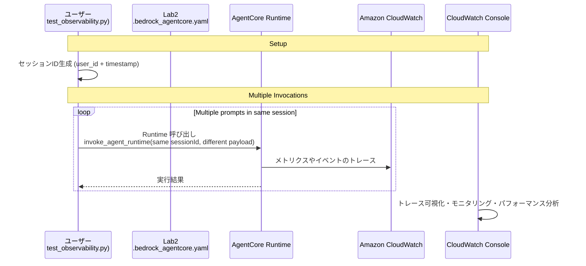

# AgentCore Observability統合

[English](README.md) / [日本語](README2_ja.md)

この実装では、本番環境でのAIエージェントの包括的なモニタリング、トレーシング、デバッグのためのAmazon CloudWatch統合を備えた **AgentCore Observability** を実演します。AgentCoreは、標準化されたOpenTelemetry（OTEL）互換のテレメトリデータを通じて、エージェントパフォーマンスへのリアルタイムの可視性を提供します。

## プロセス概要



## 前提条件

- Lab 2完了済み（エージェントがAgentCore Runtimeにデプロイ済み）

## セットアップ手順

以下の5つの手順をすべて完了する必要があります。手順が不足するとCloudWatchにトレースデータが表示されません。

### 手順1: CloudWatchトランザクション検索を有効化

トランザクション検索が有効化されているか確認します:

```bash
aws xray get-trace-segment-destination
```

以下のレスポンスが返れば有効化済みです:
```json
{
    "Destination": "CloudWatchLogs",
    "Status": "ACTIVE"
}
```

**有効化されていない場合の手動セットアップ:**

1. [CloudWatchコンソール](https://console.aws.amazon.com/cloudwatch)を開く
2. **Application Signals (APM)** → **Transaction search**に移動
3. **Enable Transaction Search**を選択
4. **構造化ログとしてスパンを取り込む**チェックボックスを選択
5. **保存**を選択
6. 数分待機し、Enabledとなったことを確認

### 手順2: AgentCore Log deliveriesを設定

AgentCoreコンソールでLog deliveriesを設定します。この設定がないと、Runtime metricsは表示されますがSessions/Traces/Spansにデータが表示されません。

1. [Amazon Bedrock AgentCoreコンソール](https://console.aws.amazon.com/bedrock-agentcore)にアクセス
2. **Build → Runtime** → **cost_estimator_agent** を選択
3. **Log deliveries and tracing** セクションを展開

**Log deliveryを2回追加:**

1回目:
- 「Add」ドロップダウン → 「Amazon CloudWatch Logs」を選択
- Log type: **APPLICATION_LOGS**
- Destination log group: `/aws/bedrock-agentcore/runtimes/cost_estimator_agent-XXXX-DEFAULT`（既存のロググループを選択）
- 「Add」をクリック

2回目:
- 「Add」ドロップダウン → 「Amazon CloudWatch Logs」を選択
- Log type: **USAGE_LOGS**
- Destination log group: 同じロググループを選択
- 「Add」をクリック

> **注意**: 「Add」ボタンには「Amazon CloudWatch Logs」「Amazon S3」「Amazon Data Firehose」の3つの選択肢があります。GenAI Observabilityダッシュボードに表示するには「Amazon CloudWatch Logs」を選んでください。

### 手順3: AgentCore Tracingを有効化

同じ画面の「Tracing」セクションで:

1. 「Edit」をクリック
2. Tracingを有効化
3. 「Save」をクリック

設定後の確認:
```
Log delivery (3)  ← S3(既存) + CloudWatch Logs(APPLICATION_LOGS) + CloudWatch Logs(USAGE_LOGS)
Tracing: Enabled  ← 有効化されている
```

### 手順4: OTel計装パッケージを追加

AgentCore Runtimeは自動的にRuntime metricsを記録しますが、エージェント内部の詳細トレース（LLM呼び出し、ツール呼び出し等のSpan）を取得するには、OpenTelemetryの計装パッケージが必要です。

`/workshop/02_runtime/deployment/requirements.txt` を開いて以下のように修正:

```txt
# Base requirements for AgentCore Runtime deployment
boto3>=1.39.9
bedrock-agentcore>=0.1.0
bedrock-agentcore-starter-toolkit>=0.1.1
strands-agents[otel]>=1.0.1          # ← [otel] を追加
strands-agents-tools>=0.2.1
aws-opentelemetry-distro              # ← 追加（AWS Distro for OpenTelemetry）
uv
```

変更点:
- `strands-agents` → `strands-agents[otel]`: Strands AgentのOTel計装を有効化
- `aws-opentelemetry-distro` を追加: ADOT（AWS Distro for OpenTelemetry）による自動計装

### 手順5: エージェントを再デプロイ

OTelパッケージの追加を反映するため、再デプロイが必要です:

```bash
cd /workshop/02_runtime
uv run agentcore deploy
```

デプロイ完了まで数分かかります。完了後にLab 4のスクリプトを実行してください。

## 使用方法

### ファイル構成

```
04_observability/
├── README_ja.md                    # このドキュメント
└── test_observability.py           # テストスクリプト
```

### スクリプトの実行

```bash
cd /workshop/04_observability
uv run python test_observability.py
```

正常に実行すると以下のような出力が表示されます:

```
🚀 Starting AgentCore Observability Tests
Loaded Agent ARN: arn:aws:bedrock-agentcore:us-west-2:...
Region: us-west-2
============================================================
Invoke test invocations in Same Session
============================================================
Generated session ID: user0001_20260302_163000_observability_test
Testing multiple invocations for user: user0001
Number of invocations: 3
--- Invocation 1/3 ---
✅ Invocation 1 completed successfully
--- Invocation 2/3 ---
✅ Invocation 2 completed successfully
--- Invocation 3/3 ---
✅ Invocation 3 completed successfully
```

### Observability Dashboardでトレースを確認
1. [Amazon Bedrock AgentCoreコンソール](https://console.aws.amazon.com/bedrock-agentcore)にアクセス
2. **Build → Runtime** → **cost_estimator_agent** を選択
3. **Endpoint** セクションの **Observability** から **Dashboard** を選択
4. **Session** タブを選択すると直近のタイムスパンで発生しているセッション一覧が表示される
5. この中から最も上に表示されているSession IDを選択すると、Session Summaryとトレース一覧が表示される
6. **Traces** の中から最も上に表示されているTrace IDを選択するとTrace Summaryとリクエストから応答間での詳細な流れを追跡・確認できる
7. Timelineビューを選択すると詳細な流れとそれぞれの処理時間をブレイクダウンして表示できる

確認できる内容:

| 画面 | 確認内容 |
|------|---------|
| Sessions | セッション一覧、トレース数、エラー数 |
| Traces | 各リクエストの処理時間 |
| Spans Timeline | 各処理のブレイクダウン（ボトルネック特定） |
| Span Events | 入出力プロンプト、ツール呼び出しの詳細 |
| Trajectory | ダイアグラム形式での処理フロー可視化 |

## 可観測性の概念

### Session / Trace / Spanの3階層

```
Session（会話全体）
  └── Trace（1回のリクエスト→レスポンス）
        └── Span（個別の処理: LLM呼び出し、ツール呼び出し等）
              └── Event（詳細な入出力データ）
```

| 階層 | 定義 | 今回の例 |
|------|------|---------|
| Session | ユーザーとの会話全体 | 1つ（同じsession_idで3回呼び出し） |
| Trace | 個々のリクエスト→レスポンス | 3つ（3回の見積もり依頼） |
| Span | トレース内の個別処理 | 複数（LLM呼び出し、ツール呼び出し等） |
| Event | Span内の詳細データ | プロンプト、レスポンス、ツール引数等 |

## トラブルシューティング

### CloudWatchにSessions/Tracesが表示されない

Runtime metricsは表示されるがSessions/Tracesが空の場合:

1. **Log deliveriesの確認**: AgentCoreコンソールでAPPLICATION_LOGSとUSAGE_LOGSの両方がCloudWatch Logsに配信されているか確認
2. **Tracingの確認**: AgentCoreコンソールでTracingがEnabledになっているか確認
3. **OTelパッケージの確認**: requirements.txtに`strands-agents[otel]`と`aws-opentelemetry-distro`が含まれているか確認
4. **再デプロイの確認**: パッケージ追加後に`agentcore deploy`を実行したか確認

### エージェントARNが見つからない

```
FileNotFoundError: Configuration file not found: ../02_runtime/.bedrock_agentcore.yaml
```

Lab 2が完了していないか、別のディレクトリから実行しています。`cd /workshop/04_observability` を確認してください。

### Transaction Searchが有効化されていない

```bash
aws xray get-trace-segment-destination
```

`ACTIVE`でない場合は、手順1に従って有効化してください。

## 参考資料

- [AgentCore Observability開発者ガイド](https://docs.aws.amazon.com/bedrock-agentcore/latest/devguide/observability.html)
- [CloudWatch GenAI Observability](https://docs.aws.amazon.com/AmazonCloudWatch/latest/monitoring/GenAI-observability.html)
- [AWS Distro for OpenTelemetry](https://aws-otel.github.io/docs/introduction)
- [GenAI向けOpenTelemetryセマンティック規約](https://opentelemetry.io/docs/specs/semconv/gen-ai/)
- [CloudWatchトランザクション検索](https://docs.aws.amazon.com/AmazonCloudWatch/latest/monitoring/CloudWatch-Transaction-Search.html)

---

**次のステップ**: Lab 5: Evaluationに進み、エージェントの品質を測定・改善する方法を学びましょう。
